# Subzero

Subzero is a local MCP service that lets coding agents spawn and control persistent subagents. Children run in isolated Pi SDK worker processes while the parent agent retains its own clean conversation. `@subzero/pi` is a thin extension connecting Pi to the service; other MCP-capable coding agents (Codex, Claude Code, OpenCode) configure the same local MCP server executable.

```mermaid
flowchart TB
  subgraph HOSTS["1. Host Layer (Parent Sessions)"]
    Hosts["<b>Parent Coding Agents</b>: Pi Agent &bull; Codex CLI &bull; Claude Code &bull; OpenCode<br/><i>Parent conversation & context window retained</i>"]
  end

  subgraph TRANSPORT["2. Transport Layer (Local MCP Stdio)"]
    Broker["<code>@subzero/runtime</code> CLI Broker<br/><i>Single local stdio process per active host session</i>"]
  end

  subgraph METHODS["Subagent Lifecycle Methods (MCP Tools)"]
    direction TB
    M_Info["<b>Discovery</b>: <code>subzero_info</code> (metadata) &bull; <code>subzero_list</code> (sessions)"]
    M_Spawn["<b>1. Spawn</b>: <code>subzero_spawn</code> (initialize child session & prompt run)"]
    M_Loop["<b>2. Interact & Observe</b>: <code>subzero_send</code> (steer/followup) &bull; <code>subzero_get</code> (poll/cursor)"]
    M_Result["<b>3. Results & Control</b>: <code>subzero_output</code> (artifacts) &bull; <code>subzero_stop</code> (cancel/reap)"]
    M_Recover["<b>4. Recovery</b>: <code>subzero_resume</code> (branch completed leaf from checkpoint)"]
    M_Info --> M_Spawn --> M_Loop --> M_Result --> M_Recover
  end

  subgraph CORE["3. Core Orchestration Layer (@subzero/core)"]
    CoreEngine["State Machine & Admission Guard <i>(Ready / Running / Interrupted)</i><br/>Followup Queues & Monotonic Event Cursors<br/>Immutable Templates <i>(researcher / coder)</i>"]
  end

  subgraph RUNTIME["4. Runtime & Persistence Layer (@subzero/runtime)"]
    RuntimeEngine["SQLite Storage (node:sqlite) — Atomic Txns & Monotonic Generations<br/>In-Memory Credential Resolver <i>(RAM only, never on disk)</i><br/>Local Disk Artifact Storage <i>(Bounded result files)</i>"]
  end

  subgraph WORKER["5. Execution Layer (Isolated Pi SDK 1.0.4 Worker)"]
    WorkerProc["Supervised Worker Process Group <i>(Runs ONLY during active work)</i><br/>Private Child Transcript <i>(Never leaks to parent context)</i><br/>Least-Privilege Tools <i>(Exact grants; zero ambient host tools)</i>"]
  end

  subgraph EDGES["⚡ What Edges Us (Security & Architectural Boundaries)"]
    direction TB
    E1["🛡️ <b>Clean Separate Conversations</b>: Parent context never polluted; private child transcript"]
    E2["🔒 <b>Stateful Stream Redaction</b>: Intercepts keys across tokens, args, & property keys"]
    E3["⚡ <b>SQLite Generation Guarding</b>: Monotonic generations prevent multi-broker split-brain"]
    E4["🛑 <b>Process Group Confinement</b>: Stdio EOF / SIGKILL reaps worker & shell children within 5s"]
    E5["🎯 <b>Zero Ambient Grants</b>: No host tools, skills, or environment secrets leaked to child"]
    E1 ~~~ E2 ~~~ E3 ~~~ E4 ~~~ E5
  end

  Hosts -->|MCP Stdio| Broker
  Broker --> M_Info
  M_Recover --> CoreEngine
  CoreEngine --> RuntimeEngine
  RuntimeEngine -->|Supervised Process Fork| WorkerProc
  WorkerProc -.->|Guarded by| EDGES
```



---

## The Design Stack

1. **Host Layer**: The parent agent (Pi, Codex, Claude Code, OpenCode) maintains its primary conversation and calls Subzero via standard MCP tools.
2. **Transport Layer**: A single local stdio MCP server per active host session (`@subzero/runtime`). No background daemons, listening ports, or network attack surface.
3. **Core Orchestration (`@subzero/core`)**: Dependency-free TypeScript engine enforcing the state machine, admission limits, follow-up queues, immutable template snapshots, and monotonic event cursors.
4. **Runtime & Storage (`@subzero/runtime`)**: Uses Node 24.15+ `node:sqlite` for transactional state, manages in-memory credential resolution, and stores large tool/result artifacts on disk.
5. **Worker Execution**: Supervised per-child worker processes (`@earendil-works/pi-coding-agent` v1.0.4). Workers exist only while work is active or queued, shutting down when idle to free resources.

---

## Subagent Lifecycle Methods

The MCP server exposes eight dedicated tools:

| Method | Role | Description |
|---|---|---|
| `subzero_spawn` | Lifecycle | Spawns a durable child session and starts its initial run with prompt, template, and model credential reference. |
| `subzero_get` | Observation | Bounded long-poll returning state (`ready`, `running`, `interrupted`), monotonic events, next cursor, and artifact pointers. |
| `subzero_send` | Interaction | Sends instructions to a child: mode `steer` modifies the active run; mode `followup` queues or starts a new run. |
| `subzero_stop` | Control | Idempotently stops `expectedRunId`, cancels queued work, and verifies process-group exit. |
| `subzero_resume` | Recovery | Restores a child after restart or idle. Read-only checkpoint check without message; branches a fresh run from the last completed leaf if message provided. |
| `subzero_output` | Artifacts | Streams full result artifacts in bounded chunks by `offset` and `length`. |
| `subzero_list` | Discovery | Lists persistent children across broker restarts scoped to the workspace. |
| `subzero_info` | Metadata | Returns protocol version, capabilities, available templates, and safe credential references. |

---

## ⚡ What Edges Us

- **Clean Separate Conversations**: Children never pollute, truncate, or consume the parent agent's context window. Each child maintains its own private conversation transcript in an isolated worker process.
- **Stateful Stream Redaction**: Real-time secret defense. Model keys split across streaming SSE deltas, tool argument payloads, or JSON property names are intercepted and redacted in-memory before entering transcripts, events, or disk.
- **SQLite Generation Guarding**: Atomic multi-broker concurrency control. Monotonic owner generations and immediate transactions prevent race conditions, duplicate writers, and stale resumes across independent processes.
- **Process Group Confinement**: Workers are bound to the broker lifecycle. Control-pipe EOF or broker SIGKILL tears down the entire POSIX process group—including spawned shell subprocesses—within 5 seconds.
- **Zero Ambient Grants**: Strict least-privilege immutable templates (`researcher` vs `coder`). Children inherit no host tools, no ambient skills, no environment secrets, and no nested delegation tools.

---

## Quickstart

### Prerequisites
Node.js 24.15 or newer and npm.

```sh
# Clone and build
npm ci
npm run verify

# Run Pi with the Subzero extension
pi -e /absolute/path/to/subzero/packages/pi/dist/index.js
```

`npm run verify` builds all packages, typechecks the workspace, and executes the complete offline test suite (128/128 passing).

For real LongCat provider verification, copy `.env.example` to `.env`, add `OPENCODE_API_KEY`, and run `npm run test:live`. See [docs/TESTING.md](docs/TESTING.md#live-longcat-check).

---

## Repository Layout

- `packages/core`: Language-neutral JSON Schemas, conformance fixtures, and dependency-free TypeScript orchestration.
- `packages/runtime`: Local MCP stdio broker, Node SQLite storage, credential resolver, and Pi SDK worker adapter.
- `packages/pi`: Thin Pi extension that registers the Subzero MCP server.
- `docs/`: Reference documentation:
  - [Reference design](docs/DESIGN.md): System architecture, capability contract, and state machine.
  - [Usage](docs/USAGE.md): Local setup, credential references, tool schemas, and host configs (Codex, Claude, OpenCode).
  - [Testing](docs/TESTING.md): Verification gates, test suite details, and live test reproduction.
  - [Plan](docs/PLAN.md): Completed milestone record.
- `experiments/pi-sdk/`: Pi SDK 1.0.4 and Node SQLite qualification probes.
